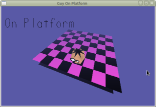

### Getting Started

---

You will need a c compiler  
Download MinGW and install from sourceforge.net  

Edit environment variables  
Add C:\\MinGW\\bin to Path  

In a command terminal type:  
gcc -v  
It should output the compiler version  

In a command terminal cd to the "Source" directory and type:  
echo mingw32-make.exe -f .\\Makefile.win %1 > make.bat

Then type:  
make  
This should compile the source code using "Makefile.win"  

Note: If using a different compiler it might be easier to compile the demos in the "Documentation" directory first.  

Once you have a working compiler try the howTos or start modding the source code.  

[View HowTos](howTos/index.md)  
[View Functions](functions/index.md)  

---

