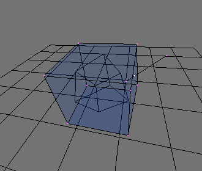
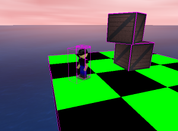
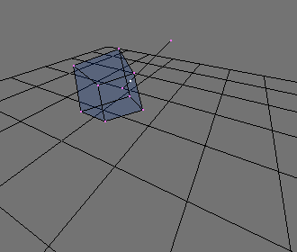
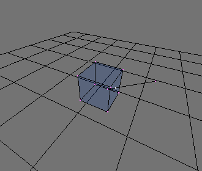
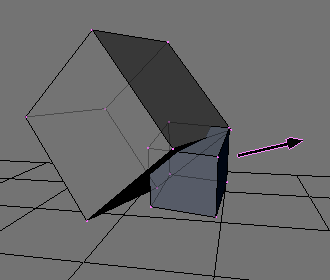
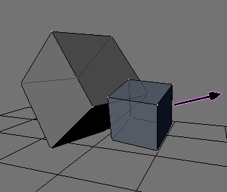
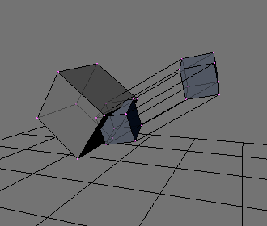
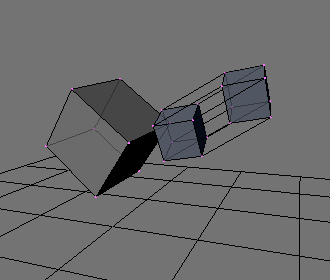

% collisionDetect.c

---

### parallQuadToNormBoxContact()

This function will return true if a parallelogram is contacting a box created by a mesh's transformation data. The box is not oriented and so is in a normalized state.

---

### boundsContact()

Uses the bounds radius of a mesh to create a box and determine if it is contacting or within the bounds of another box created the same way.  

The bounds radius is the distance from the center to one corner of a transformation box.  

---

### nonOrientBoxContact()

Returns true if a box, created by a mesh's transformation data, is contacting or within the bounds of another box. Both boxes are not oriented with any rotation data.

---

### ptToBoundsCollision()

This function will return the preset location of the point (the point of collision) if it did collide with the box, the face it collided with (0=none, 1=right, 2=left, 3=back, 4=front, 5=top, 6=bottom), and if it collided from the outside or not.

---

### ptToBoxCollision()

For this function the bounds box is not used. The transformation box will be used instead and unlike the bounds box this box can be rotated in any direction. 

This function will return the preset location of the point (the point of collision) if it did collide with the box, the face it collided with (0=none, 1=right, 2=left, 3=back, 4=front, 5=top, 6=bottom), and if it collided from the outside or not.

 

The math within the function will normalize the box using unit circle data. This is fast because it does not use transcendental functions (functions with lots of operations). It will then undo normalization for returning the point of collision.

---

### globalBoxKnockOut()
Uses the "localBoxKnockOut" function to determine if a box, created by a mesh's size data within the transformation data, is within other "fixed boxes" and if so for each "fixed box" moves the "moving box" to the outside.  

Note:  
The function will go through each "fixed box" in order and the "moving box" will be moved during processing. If the "moving box" is moved inside another box it won't be moved again unless the function has not already processed the "fixed box" the "moving box" was moved in.  

---

### globalBoxDetectAndMove()
Uses the "localBoxDetectAndMove" function to determine if a box, created by a mesh's transformation data, is within other "fixed boxes" and if so moves the "moving box" to the outside in the direction of the "xArrow", "yArrow", and "zArrow" variables.  

Note:  
The function will go through each "fixed box" to find the longest travel distance and the "moving box" will not be moved during processing.  

---

### globalBoxCollision()
Uses the "localBoxCollision" function to determine if a box, created by a mesh's transformation data, collided with other "fixed boxes" and if so moves the "moving box" to the point of first contact.  

Note:  
The function will go through each "fixed box" to find the shortest travel distance and the "moving box" will not be moved during processing.  

---

### localBoxKnockOut()
This function can knock one box, the "moving box", from another box, the "fixed box". It will return travel distance and information on if the boxes had contacted and also return which faces contacted last using a single integer in the following format:  

"fixed box" +X face ==             0b1  
"fixed box" +Y face ==            0b10  
"fixed box" +Z face ==           0b100  
"fixed box" -X face ==          0b1000  
"fixed box" -Y face ==         0b10000  
"fixed box" -Z face ==        0b100000  
"moving box" +X face ==      0b1000000  
"moving box" +Y face ==     0b10000000  
"moving box" +Z face ==    0b100000000  
"moving box" -X face ==   0b1000000000  
"moving box" -Y face ==  0b10000000000  
"moving box" -Z face == 0b100000000000  

Note:  
This function will not knock a box out in the direction of its faces but rather in the direction of one center to another center.  

---

### localBoxDetectAndMove()
Detects if the "moving box" is within the "fixed box" and moves the "moving box" in the direction of the "xArrow", "yArrow", and "zArrow" variables out of the "fixed box". If the "alwaysMove" variable is true, the "moving box" will still move even though it is not within the "fixed box". If no direction given to move the "moving box" (xArrow=0, yArrow=0, zArrow=0), the "moving box" will not be moved. This function will return travel distance and information on if the boxes had contacted and also return which faces contacted last using a single integer in the following format:  

"fixed box" +X face ==             0b1  
"fixed box" +Y face ==            0b10  
"fixed box" +Z face ==           0b100  
"fixed box" -X face ==          0b1000  
"fixed box" -Y face ==         0b10000  
"fixed box" -Z face ==        0b100000  
"moving box" +X face ==      0b1000000  
"moving box" +Y face ==     0b10000000  
"moving box" +Z face ==    0b100000000  
"moving box" -X face ==   0b1000000000  
"moving box" -Y face ==  0b10000000000  
"moving box" -Z face == 0b100000000000  

 

---

### localBoxCollision()
Detects if a "moving box" has collided with a "fixed box" and finds the impact location of the "moving box". This function will return travel distance to impact and information on if the boxes had impacted or just contacting. It will also return which faces contacted first after impact using a single integer in the following format:  

"fixed box" +X face ==             0b1  
"fixed box" +Y face ==            0b10  
"fixed box" +Z face ==           0b100  
"fixed box" -X face ==          0b1000  
"fixed box" -Y face ==         0b10000  
"fixed box" -Z face ==        0b100000  
"moving box" +X face ==      0b1000000  
"moving box" +Y face ==     0b10000000  
"moving box" +Z face ==    0b100000000  
"moving box" -X face ==   0b1000000000  
"moving box" -Y face ==  0b10000000000  
"moving box" -Z face == 0b100000000000  

 

---

