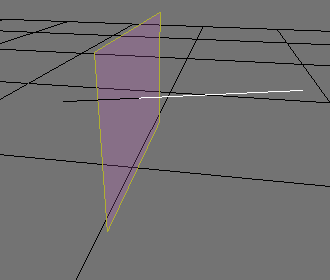
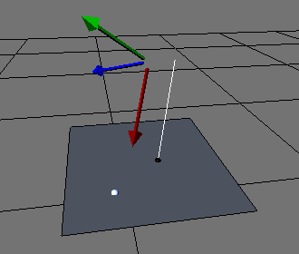

% path.c

---

### resizeLineToPlaneX()

Resizes a line to a plane that is parallel to the y and z axises.

---

### resizeLineToPlaneY()

Resizes a line to a plane that is parallel to the x and z axises.

---

### resizeLineToPlaneZ()

Resizes a line to a plane that is parallel to the x and y axises.

---

### travelParallelToAxisX()

Finds the distance to move a point to the closest plane (x, y, or z) a destination point is on by following a relative x axis.

---

### travelParallelToAxisY()

Finds the distance to move a point to the closest plane (x, y, or z) a destination point is on by following a relative y axis.

---

### travelParallelToAxisZ()

Finds the distance to move a point to the closest plane (x, y, or z) a destination point is on by following a relative z axis.

---

### xPlaneSkidPath()

Finds the skid direction on the x plane using an object's trajectory.

---

### yPlaneSkidPath()

Finds the skid direction on the y plane using an object's trajectory.

---

### zPlaneSkidPath()

Finds the skid direction on the z plane using an object's trajectory.

---

### getDirectionChgAngle()

Finds an angle representing two differnt directions.

---

### getTravelLength()

Finds the distance to get to a position.

---

