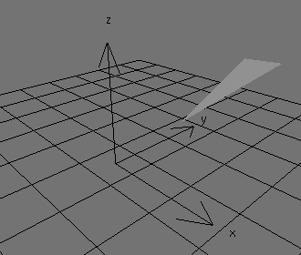
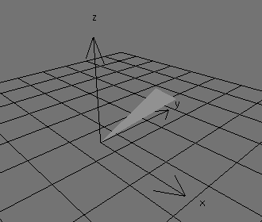
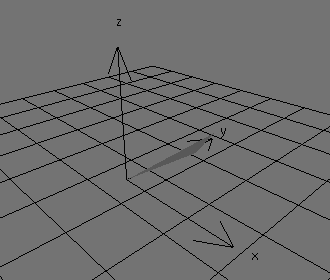
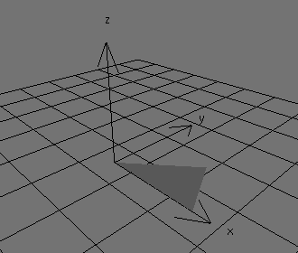
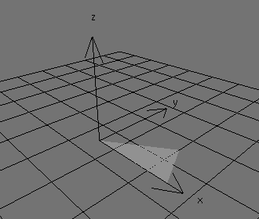
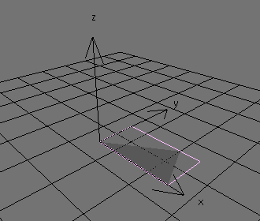
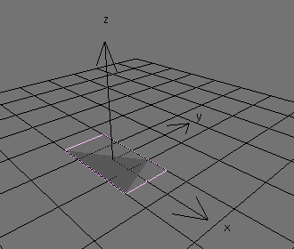
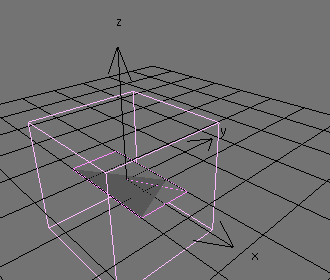

% polyTransData.c

---

### makeTriTransData()

Creates an array of transformation data blocks representing each polygon of each mesh object.  
Each data block will contain:  
> x, y, z, rotation  
> x, y, z, location  
> x, y, z, size  
> y, z, unit circle coordinates for x rotation  
> x, z, unit circle coordinates for y rotation  
> x, y, unit circle coordinates for z rotation  
> bounds radius,  

This function will use transcendental functions to find how to put a triangle into a normalized state and get transformation data representing its orientation, location, and size.

 

 

 

 

---

### makeQuadTransData()

Uses makeTriTransData() to create an array of transformation data blocks representing each polygon of each quad of each mesh object.  
Each data block will contain:  
> x, y, z, rotation  
> x, y, z, location  
> x, y, z, size  
> y, z, unit circle coordinates for x rotation  
> x, z, unit circle coordinates for y rotation  
> x, y, unit circle coordinates for z rotation  
> bounds radius,  

---

