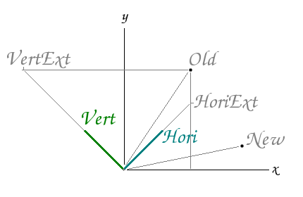
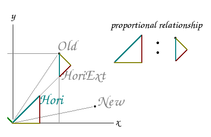

% applyRotLocSz.c

---

### applyRotLocSz()

---

### applyViewRotLocSz()

---

### applyTriAxisToPoint()

---

### reverseApplyTriAxisToPoint()
Find the new location of a point relative to axises that have been normalized.

*Copy and Paste:*  

if (yRadial == 0.0)  

y = zP * zRadial;  
z = yP * -zRadial;  

else  

y = (yP - yLine2 / zLine2 * zP) * zLine2;  
z = (zP - zLine1 / yLine1 * yP) * yLine1;  

yHoriExt = vP * hLine2 + hP * vLine2;  
xVertExt = hP * vLine1 + vP * hLine1;  

h = vP * hLine2 + hP * vLine2;  
v = hP * vLine1 + vP * hLine1;  

// extend horizontal axis  
//xHoriExt = xOld;  
yHoriExt = yHori - (xHori - xOld) / xHori * yHori;  

// extend vertical axis  
xVertExt = xVert - (yVert - yOld) / yVert * xVert;  
//yVertExt = yOld; 

---

xNew = (xOld - xVertExt) * yVert;  
yNew = (yOld - yHoriExt) * xHori;  

xNew = vP * hLine2 + hP * vLine2;  
yNew = hP * vLine1 + vP * hLine1;  

h = vP * hLine2 + hP * vLine2;  
v = hP * vLine1 + vP * hLine1;  

---
