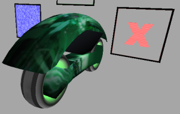

% Add Texture

---

This howto will add texture to a light cycle mesh in the 4th scene.

Note that the "Add Mesh" howto must be completed first.

Go into the "meshes" folder.  
Then within the "texture" folder open a terminal and type:  
**texToC lightCycle.bmp lightCycleMask.bmp**

This should convert the .bmp files into source code.

---

**In main.c**

---

**Add under the includes:**

~~~ {.c}
#include "meshes/texture/lightCycleTexData.h"
~~~

---

**In scene4.c**

---

**Find:**

~~~ {.c}
glClear(GL_COLOR_BUFFER_BIT | GL_DEPTH_BUFFER_BIT);
glClearColor(0.65f, 0.65f, 0.65f, 1.0f);

glDisable(GL_FOG);
~~~

**And replace with:**

~~~ {.c}
glClear(GL_COLOR_BUFFER_BIT | GL_DEPTH_BUFFER_BIT);
glClearColor(0.65f, 0.65f, 0.65f, 1.0f);

glDisable(GL_FOG);

// ADD TEXTURES

if (useTexture == TRUE)
{
   // add light cycle texture
   addTexture(&lightCycleTexPtrGL, &lightCycleTexData[0],
              &lightCycleTexWidth[0], &lightCycleTexHeight[0], lightCycleTexCount, 1);
}

// END OF ADD TEXTURES
~~~

---

**Find:**

~~~ {.c}
// draw mesh
drawMesh(&lightCycle_POINT[0], &lightCycle_QUAD[0], &lightCycle_TRI[0], &lightCycle_VCOLOR[0],
         &lightCycle_TEX[0], &lightCycle_TEXCOORD[0], &lightCycle_TEXLINKDAT[0],
         &lightCycle_QUADDATSZ[0], &lightCycle_TRIDATSZ[0], &lightCycle_HIDE[0], 0, lightCycle_MESHCNT, rI);
~~~

**And replace with:**

~~~ {.c}
// add textures to the mesh
lightCycle_TEX[lightCycle_lightCycle_bmp] = lightCycleTexPtrGL;

// draw mesh
drawMesh(&lightCycle_POINT[0], &lightCycle_QUAD[0], &lightCycle_TRI[0], &lightCycle_VCOLOR[0],
         &lightCycle_TEX[0], &lightCycle_TEXCOORD[0], &lightCycle_TEXLINKDAT[0],
         &lightCycle_QUADDATSZ[0], &lightCycle_TRIDATSZ[0], &lightCycle_HIDE[0], 0, lightCycle_MESHCNT, rI);
~~~

---

**Find:**

~~~ {.c}
// END OF DRAW //
////////////////////////////////////////////////////////////////////
~~~

**And replace with:**

~~~ {.c}
deleteTextures();

// END OF DRAW //
////////////////////////////////////////////////////////////////////
~~~

---

---

The compiler needs to be told to compile the texture data.

To compile with gcc:

**In Makefile.win**

---

**Find:**

~~~ {.c}
meshes\texture\boxTexData.o
~~~

**And replace with:**

~~~ {.c}
meshes\texture\boxTexData.o meshes\texture\lightCycleTexData.o 
~~~

---

To compile with tcc:

**In tmake.bat**

---

**Find:**

~~~ {.c}
meshes\texture\boxTexData.o
~~~

**And replace with:**

~~~ {.c}
meshes\texture\boxTexData.o meshes\texture\lightCycleTexData.o 
~~~

---

**Find:**

~~~ {.c}
if NOT exist rsrc.res ..\..\tccAndTools\Gorc\Gorc.exe /r rsrc.rc
~~~

**And replace with:**

~~~ {.c}
if NOT exist meshes\texture\lightCycleTexData.o ..\..\tccAndTools\tcc\tcc.exe -c meshes\texture\lightCycleTexData.c -o meshes\texture\lightCycleTexData.o

if NOT exist rsrc.res ..\..\tccAndTools\Gorc\Gorc.exe /r rsrc.rc
~~~

---

Compile and run.

Press enter 4 times to see the results in the 4th scene.

---

